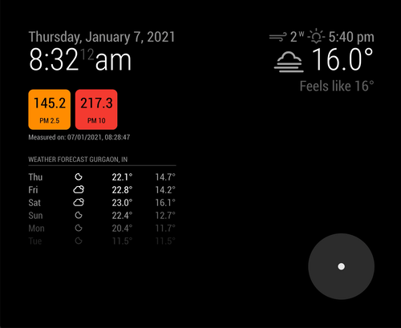

# MMM-Breathwork

This a module for the [MagicMirror](https://github.com/MichMich/MagicMirror/tree/develop).

Shows a Breathing Exercise to calm you down. [src](https://pubmed.ncbi.nlm.nih.gov/24380741/)

# Installation

1. Navigate into your MagicMirror `modules` folder and execute
   `git clone https://github.com/yashatgit/MMM-Breathwork.git`.
2. That's it! No external dependencies.

## Sample Configuration

```
{
  module: "MMM-Breathwork",
  position: "bottom_right",
},
```

## Screenshots


